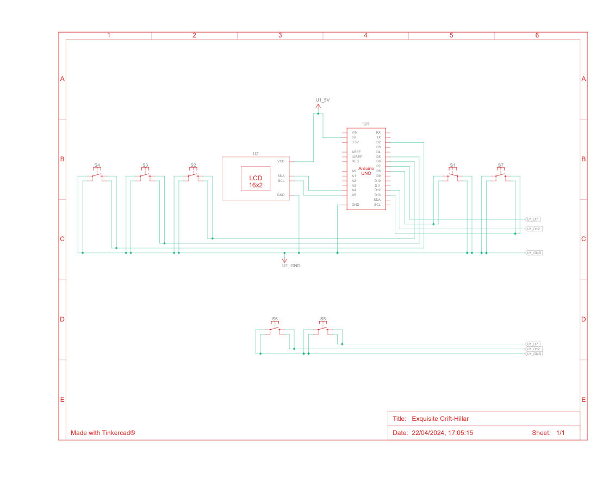
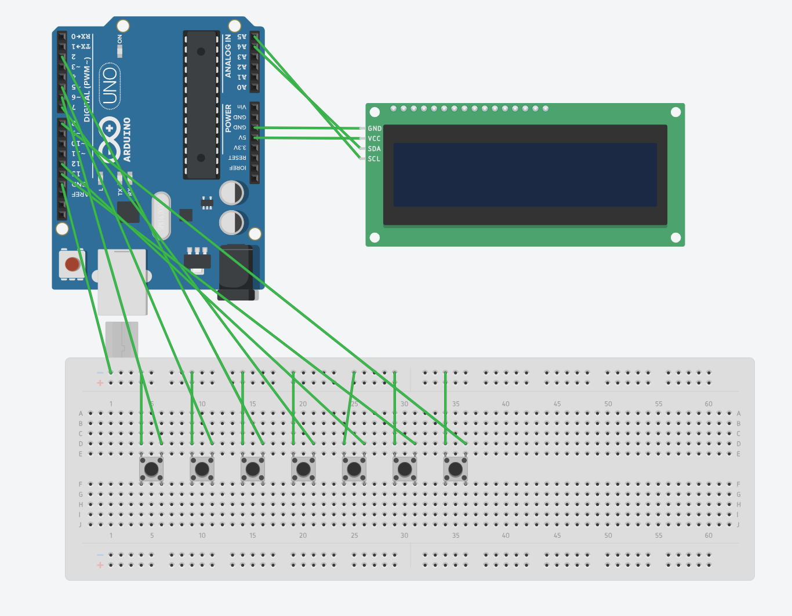

# Cricket Scorecard with Arduino

This project implements a cricket scorecard using an Arduino Uno and a 16x2 LCD display. It allows users to keep track of runs, balls, wickets, and other match statistics.

## Components Used
- Arduino Uno
- 16x2 LCD display
- 7 buttons (runs, balls, ball decrement, wicket, wicket decrement, 6, 4)

## Features
- Increment runs, balls, wickets
- Decrement balls and wickets
- Special buttons for 6s and 4s
- Real-time display of current run rate, required run rate, and runs required in balls

## Setup
1. Connect the 16x2 LCD display to the Arduino Uno.
2. Connect the 7 buttons to the Arduino Uno for user inputs.
3. Upload the Arduino sketch to the Arduino Uno.

## Usage
- Press the "runs" button to increment the runs.
- Press the "balls" button to increment the balls.
- Press the "ball decrement" button to decrement the balls.
- Press the "wicket" button to increment the wickets.
- Press the "wicket decrement" button to decrement the wickets.
- Press the "6" button to increment the runs by 6.
- Press the "4" button to increment the runs by 4.

## Circuit Diagram

## Pictorial Circuit Diagram

## Project Picture

## Author
- Madhusudana M

